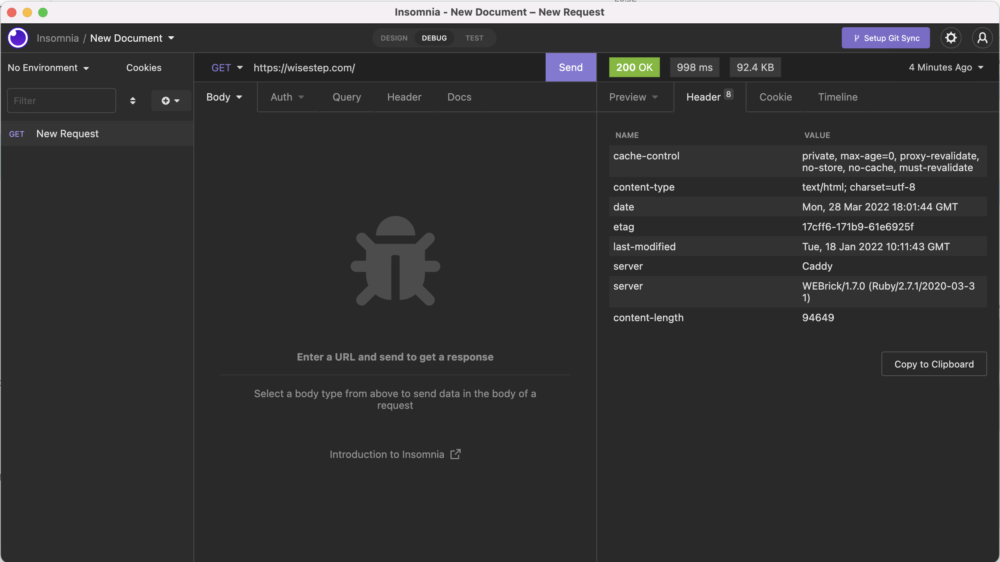

# Hiding the server response

Considering the sensitivity of the server responses, where and how it is deployed, we want to remove the server response from the headers

## Remove the server response on headers 

, Used [insomnia](https://insomnia.rest/), HTTP client website like postman, to check with the header of the request.

- Here is the `Caddyfile`

```bash
(common) {
    header /* {
        -Server
    }
}

example.com {  
  reverse_proxy localhost:3000
  import common
}
```

## Ref

- [Cadd Header Conf](https://caddyserver.com/docs/caddyfile/directives/header#syntax)
- [Insomnia HTTP client website](https://insomnia.rest/)

