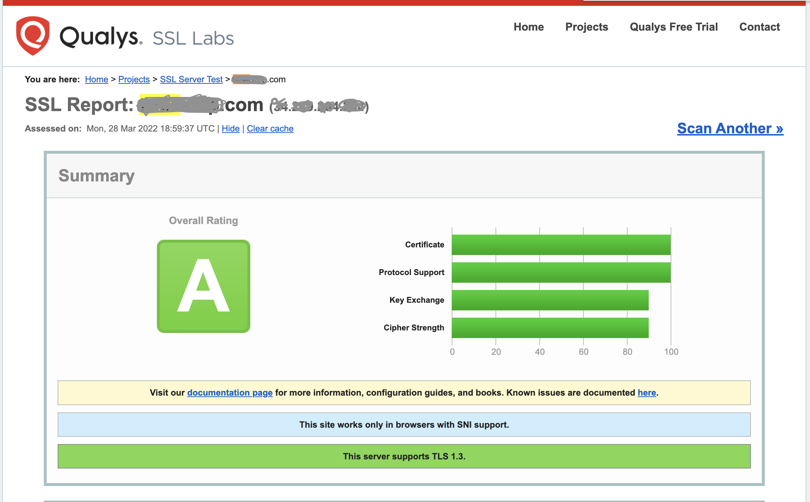

# SSL Configuration in Caddy 

Caddy is inbuild with SSL configuration when we use the `tls` directive with the `Caddyfile` configuration. 

### Default SSL Configuration

Caddy has solid SSL handling built right into its core. Use the tls directive in your Caddyfile to let Caddy do the work. Caddy automatically issues SSL certificates and securely configures the SSL setup.

You don't need to worry about certificate paths as you need to in Nginx. Caddy handles everything for you.

Here's a sample Caddyfile with SSL setup for the `vibhuvi.com` domain:

```bash
vibhuvi.com {  
  tls hello@vibhuvi.com

  reverse_proxy localhost:2022
}

:2022 {
    respond "Welcome to Caddy SSL Conf"
}
```

That's it! The one line containing the `tls` directive tells Caddy to serve the domain via SSL and use the given email address for the ACME account that manages the site's certificates. 

ACME: Automatic Certificate Management Environment Certificate authority, `cert-manager` will generate a private key which is used to identify you with the ACME server.

Caddy also redirects any HTTP traffic to HTTPS when using the `tls` directive. You can also customize TLS versions, ciphers, curves, the used key type, and so on.  Test your SSL setup on [ssllabs](https://www.ssllabs.com/ssltest).



### Custom SSL Configuration 

Add your private key and certificate chain in Caddy as below

```bash
tls cert key
```

**cert**: is the certificate file. If the certificate is signed by a CA, this certificate file should be a bundle: a concatenation of the server's certificate followed by the CA's certificate.

```bash
cat server.crt bundle.pem > fullchain.pem
```

**key** is the server's private key file which matches the certificate file.

Configuring Caddy specifically to listen on HTTP and HTTPS default ports by specifying the scheme for each site.

```bash
# HTTP->HTTPS redirects
http://xyz.example, http://api.xyz.example {
  redir https://{host}{uri}
}

https://xyz.example {
    # Custom SSL Conf
    tls /ssl/certs/fullchain.pem /ssl/certs/key.pem
}

https://api.xyz.example {
    # Custom SSL Conf
    tls /ssl/certs/fullchain.pem /ssl/certs/key.pem
}
```
## Ref
- [SSL Labs](https://www.ssllabs.com/ssltest).
- [ACME](https://cert-manager.io/docs/configuration/acme/)
